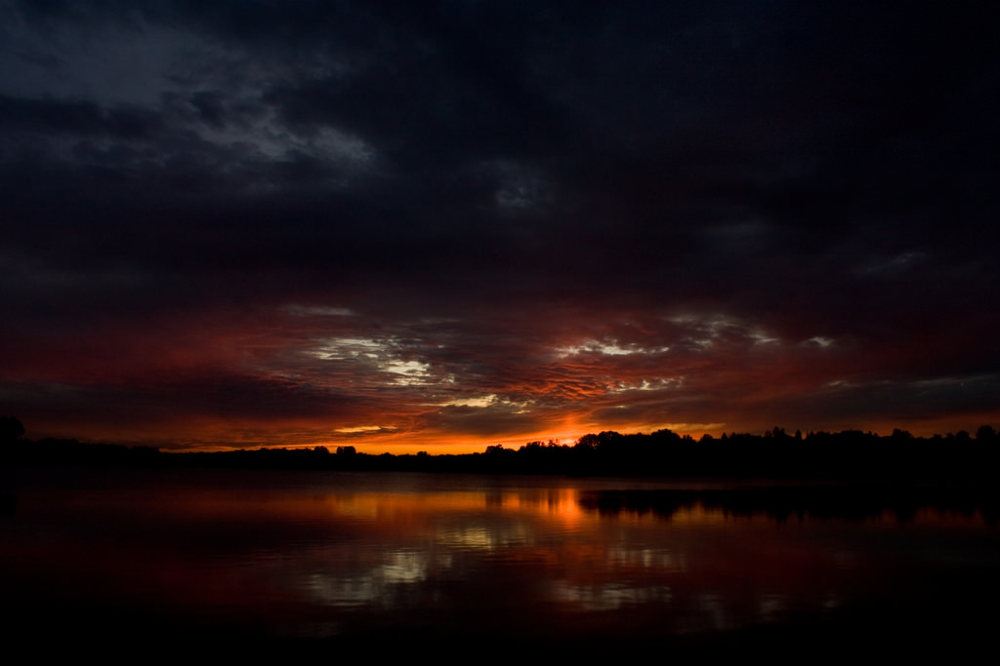

# Automatic Image Enhancement
This repository contains a few algorithms for automatic image enhancement.

They can be acessed by importing *filters.py*, and using the functions given with arguments a source image and a destination path

All images should be in .jpg format and be non-greyscale format

Example:

```python
python main.py source_image destination_folder
```

## Implementation
The currently availabe algorithms are:
1. Gamma correction

   Based on [Average Brightness Correction](https://pdfs.semanticscholar.org/03c6/3c2234335b6abea7dc8b704bda90ca58e20b.pdf)

2. Fake HDR using WLS (Weighted Least-Squares) as detail detector

   Based on [Fake HDR Research Paper](https://arxiv.org/pdf/1708.00636.pdf)
   
   Uses detail detector from [Weighted Least-Squares Research Paper](http://evasion.imag.fr/Enseignement/cours/2009/ProjetImage/multiscale/multiscale.pdf)

3. Fake HDR using Anisotropic Diffusion as detail detector

   Based on the same research paper, but with a slightly modified pipeline

4. Fake HDR using Bilateral Filter as detail detector

   Another variant on the research paper above

All algorithms work best on slightly underexposed, sharp images. (Not blurred)

## Performance comparison

The benchmark script code can be modified to test additional functions if needed and have additional test sets

The default test sets are "high_res", "medium_res", "low_res"

The source folder must have those folders created, each folder having as many images as the user desires to be tested

Otherwise, the script can be run with
```python
python benchmark.py [source_folder] [results_folder]
```
source_folder = "benchmark_images" and results_folder = "benchmark_results" are used by default

Tests were run on a Mac mini (Late 2014)
Processor: 2,8 GHz Intel Core i5

### Number of tested algorithms: 4
### Number of test sets: 3

Test set 1: Low resolution - 250 photos

Test set 2: Medium resolution (720p) - 100 photos

Test set 3: High resolution (1080p) - 30 photos

#### Average runtime (in seconds)
Algorithm \ Test Set | Low Res | Med Res | High Res
---|---|---|---
gamma|  0.027|  0.045|  0.066
hdr_wls|  7.039| 14.001| 29.992
hdr_adiff|  1.374|  3.168|  4.572
hdr_bilat|  0.442|  0.890|  1.348
hdr_cpp|  0.303|  0.503|  0.792
hdr_cpp_const_O3|  0.224|  0.361|  0.503


#### Average size (% of original image)
Algorithm \ Test Set | Low Res | Med Res | High Res
---|---|---|---
gamma|100.452|100.350|100.541
hdr_wls|231.093|236.747|239.826
hdr_adiff|247.799|256.998|259.003
hdr_bilat|224.842|238.894|237.811
hdr_cpp|  222.011|  235.568|  233.932
hdr_compressed| 140.174| 143.709| 145.222

# Examples of enhancement

As we can see, the HDR WLS algorithm has the most visually pleasing results. However, it is very slow. Anisotropic diffusion was proposed as a faster alternative, however halo artifacts can be seen on photos that were processed with it. The most effective algorithm seems to be the Bilateral Filter approach, which has similar results to the WLS approach (although introducing a bit more noise in the processed photo, it is barely noticeable) and runs 20x faster.

Original:

Processed:

Original:

Processed:


## Close-ups
Original

HDR WLS

HDR Bilateral

